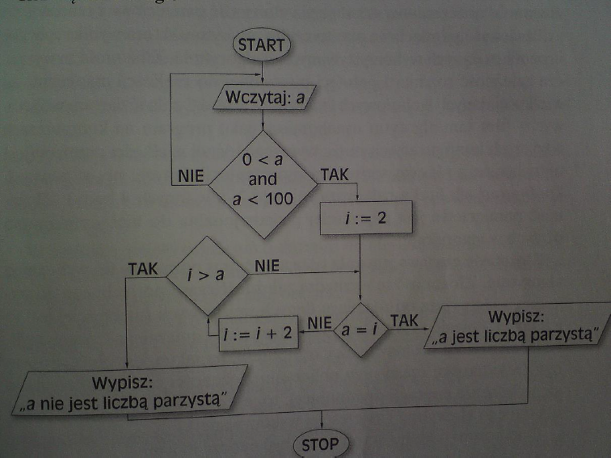
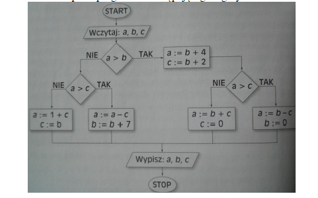

# Przykłady

### **Zadanie. 1.**
Napisać algorytm/program sprawdzający, które z 99 wprowadzonych z
klawiatury liczb jest podzielnych przez 5.

### **Zadanie. 2.**
Napisać algorytm/program sprawdzający, czy wprowadzona z klawiatury
liczba jest pierwsza.

### **Zadanie. 3.**
Napisać algorytm/program, który wyznacza iloczyn 2*4*6*...*2n dla dowolnie
ustalonego n należące N - podanego przez użytkownika.

### **Zadanie. 4.**
Napisać program, który po wprowadzeniu liczby n wypisze sumę liczb
parzystych mniejszych od n.

### **Zadanie. 5.**
Napisać algorytm/program rozwiązujący równanie 𝑎𝑥 + 𝑏 = 1 po podaniu
przez użytkownika liczb 𝑎 i 𝑏.

### **Zadanie. 6.**
Napisać algorytm/program wyznaczający wartość 𝑎𝑏 dla wprowadzonych
niezerowych liczb całkowitych/naturalnych 𝑎 i 𝑏.

### **Zadanie. 7.**
Napisać algorytm/program który pozwoli na wprowadzenie 5 liczb oraz
wypisze sumę wprowadzonych liczb dodatnich i ich ilość.

### **Zadanie. 8.**
Napisać program do następującego algorytmu

 

### **Zadanie. 9.**
Dane jest n naturalne. Napisać algorytm/program, który wyznaczy n
początkowych wyrazów ciągu określonego następująco: 𝑎1 = 2, 𝑎𝑘+1 = 1 + 2𝑎𝑘 dla
𝑘 ≥ 2.

### **Zadanie. 10.**
Napisać program rozwiązujący równanie 𝑎𝑥2 + 𝑏𝑥 = 1 po podaniu przez
użytkownika liczb 𝑎 i 𝑏.

### **Zadanie. 11.** 
Napisać program do następującego algorytmu:

 

### **Zadanie. 12.**
Napisać program do następującego algorytmu:

 

### **Zadanie. 13. Napisać program/algorytm sumujący podawane przez użytkownika liczby do momentu podania przez niego liczby 0, a następnie wypisujący otrzymaną sumę i ilość podanych liczb (włącznie z zerem/niezerowych).

### **Zadanie. 14. **
Napisać program/algorytm wypisujący wszystkie dzielniki podanej przez użytkownika liczby.

### **Zadanie. 15.** 
Napisać program/algorytm wyznaczający najmniejszy wspólny dzielnik.

### **Zadanie. 16.v 
Napisać program/algorytm wyznaczający największy wspólny dzielnik.

### **Zadanie. 17.** 
Napisać program/algorytm wyznaczający najmniejszą wspólną wielokrotność.

### **Zadanie. 18.** 
Napisać program/algorytm wyznaczający wszystkie czynniki pierwsze podanej liczby

### **Zadanie. 19.** 
Liczbami bliźniaczymi nazywamy dwie liczby pierwsze 𝑝 i 𝑞 takie, że 𝑞=𝑝+2. Napisać program/algorytm znajdujący pierwszych 20 par liczb bliźniaczych.

### **Zadanie. 20.** 
Napisać program/algorytm znajdujący pięć najmniejszych liczb naturalnych 𝑛, takich, że liczba 𝑛2−1 jest iloczynem trzech różnych liczb pierwszych.

### **Zadanie. 21.** 
Napisać program/algorytm sprawdzający, czy podane dwie liczby są pierwsze.

### **Zadanie. 22.**
Napisać program/algorytm liczący sumę cyfr podanej liczby naturalnej.

### **Zadanie. 23.**
𝑛-cyfrowa liczba Armstronga to liczba naturalna równa sumie 𝑛-tych potęg swoich cyfr. Napisać program/algorytm wyznaczający wszystkie dwucyfrowe (𝑘-cyfrowe) liczby Armstronga.

### **Zadanie. 24.**
Napisać program/algorytm wyznaczający pole prostokąta o podanych bokach.

### **Zadanie. 25.**
Napisać program/algorytm sprawdzający, czy dwa okręgi o podanych środkach i promieniach mają punkty wspólne.
